# METRICC
**Model, Edits, Time-windows, Release, Info, Context for Claude Code**

## A Clean, Lightweight, Design Focused Status Bar for Claude Code

[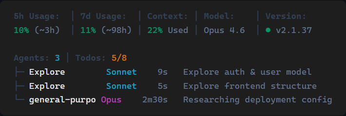](https://raw.githubusercontent.com/professionalcrastinationco/METRICC/main/docs/images/hero-agents.png)

> **Tip:** Click the image above to view it full-size.

No dependencies to install. Just one file.

---

## Before & After

Same data. Same five columns. Look how much space the new layout saves.

**Old:**
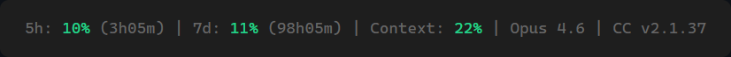

**New:**
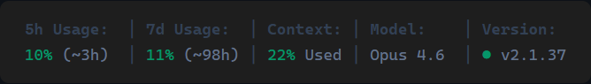

---

## What's New in v2

- **Two-row layout** — Labels sit above their values in aligned columns instead of everything crammed into one line
- **Tailwind color palette** — Switched from basic ANSI colors to Tailwind's Emerald, Amber, and Red for status indicators, and Slate shades for labels and separators
- **Configurable columns** — Toggle any segment on or off via `config.jsonc`. Show only what you care about
- **Responsive width** — Columns auto-drop on narrow terminals, starting with the least important
- **New segments** — Cost, Session timer, Directory, Tokens, Output Tokens, Cache hit rate, API Time, standalone reset countdowns
- **Full model names in agents** — Agent tree now shows "Sonnet", "Opus", "Haiku" instead of single letters
- **Cleaner reset times** — Shows `(~3h)` instead of `(3h05m)` — you don't need the minutes
- **Third row** for agents and todos only appears when they're active — no wasted space
- **macOS Keychain merged** — No more separate v2 file. Keychain fallback is built in

---

## Why this exists

There are already a hundred Claude Code status bars. Most of them look like someone threw a JSON object at a terminal and called it a day. No offense. Ok, some offense.

I'm a graphic designer with 20+ years of experience and ADHD. I notice when something looks like shit, and I physically cannot parse cluttered information without my brain leaving the building. So I built the status bar I actually wanted to look at.

1. **Scannability** — Glance for half a second, get what you need. If you have to *read* a status bar, it failed.
2. **Zero visual noise** — No borders, no boxes, no unnecessary separators. Just the data, breathing.
3. **Zero extra dependencies** — Pure Claude Code API. Nothing to install, nothing to break.

If you want charts and twelve customizable widgets, there are great options out there. Genuinely. Go nuts. If you just want to glance down and know what's going on, this is it.

---

## Who built this?

Claude Code wrote the code. I just refused to accept "good enough" approximately forty-seven times in a row. Claude Code's contribution was not telling me to go fuck myself, which honestly showed remarkable restraint.

---

## Features at a Glance

METRICC has 16 configurable segments across three sections. Standard segments are on by default; the rest are opt-in via `config.jsonc`.

| Segment | Section | Default | Description |
|---------|---------|---------|-------------|
| 5h Usage | Standard | On | 5-hour rolling rate limit with reset countdown |
| 7d Usage | Standard | On | 7-day rolling rate limit with reset countdown |
| Context | Standard | On | Context window usage percentage |
| Model | Standard | On | Current Claude model (Opus 4.6, Sonnet 4.5, etc.) |
| Version | Standard | On | Claude Code version with update indicator dot |
| Session | Session | Off | How long the current session has been running |
| Changes | Session | Off | Lines added/removed this session |
| Directory | Session | Off | Current workspace path |
| Cost | Session | Off | Session cost in USD |
| Tokens | Advanced | Off | Total input tokens in current context |
| Output Tokens | Advanced | Off | Cumulative output tokens across session |
| Cache | Advanced | Off | Cache read hit rate percentage |
| API Time | Advanced | Off | Time spent waiting for API responses |
| 5h Reset | Advanced | Off | Standalone 5-hour reset countdown |
| 7d Reset | Advanced | Off | Standalone 7-day reset countdown |
| Agents | Auto | Auto | Running agent count + tree (appears when active) |
| Todos | Auto | Auto | Task progress (appears when active) |

---

## What Each Piece Means

The screenshots below show **zoomed-in views** of each segment. Where applicable, the old version is shown first so you can see the width difference — the new two-row layout is consistently narrower while showing more information.

---

### Rate Limits — `5h Usage` and `7d Usage`

Your Anthropic API usage across two windows: the **5-hour** rolling window and the **7-day** rolling window. The percentage shows how much of your limit you've used. The time in parentheses is a rough countdown until that window resets.

**Old:**


**New:**


The color changes automatically as you use more of your limit:

<table><tr>
<td><strong>Normal</strong><br></td>
<td><strong>Warning (60%+)</strong><br></td>
<td><strong>Critical (80%+)</strong><br></td>
</tr></table>

---

### Context Window

How full the current conversation's context window is. This is the amount of "memory" Claude has for this session.

**Old:**
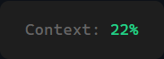

**New:**


The same green/yellow/red color coding applies — it turns yellow at 70% and red at 85%:

<table><tr>
<td><strong>Normal</strong><br>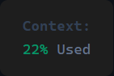</td>
<td><strong>Warning (70%+)</strong><br>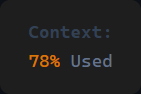</td>
<td><strong>Critical (85%+)</strong><br>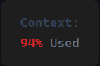</td>
</tr></table>

---

### Code Changes

Lines of code **added** (green) and **removed** (red) during this session. A quick way to gauge how much work has been done without running `git diff`.

**Old:**
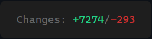

**New:**


---

### Model and Version

The Claude model you're currently using (Opus 4.6, Sonnet 4.5, Haiku 4.5, etc.) and your Claude Code version. A **green dot** means you're on the latest version. A **yellow dot** means an update is available.

**Old:**
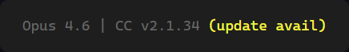

**New:**


---

### Running Agents

When Claude Code launches background agents (for research, exploration, etc.), they appear here. The count shows how many are active, and a tree view below the main bar shows details for each one.

**Old:**
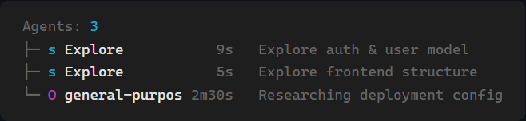

**New:**


- The model name is color-coded — **Sonnet** (cyan), **Opus** (purple), **Haiku** (green)
- How long the agent has been running
- What the agent is doing

Agents that have been running for over 30 minutes are automatically marked as stale and hidden.

---

### Todo Progress

When Claude Code is tracking tasks (via `TodoWrite` or `TaskCreate`), this shows how many are done out of the total. Yellow means there's still work to do — it turns green when all tasks are complete.

**Old:**
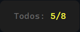

**New:**
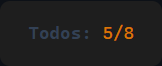

**Complete:**
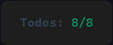

---

### Session Timer *(new in v2)*


How long the current session has been running. Shows hours and minutes (e.g., `1h42m`) or minutes and seconds for shorter sessions.

---

### Cost *(new in v2)*

Session cost in USD. Color-coded by spend:

<table><tr>
<td><strong>Normal (&lt;$0.25)</strong><br></td>
<td><strong>Warning ($0.25–$1)</strong><br></td>
<td><strong>High ($1+)</strong><br></td>
</tr></table>

---

### Working Directory *(new in v2)*


The current workspace directory Claude Code is operating in.

---

## Configuration

METRICC is configurable via `~/.claude/hud/config.jsonc`. This file controls which columns appear in your status bar.

The file uses JSONC format (JSON with comments), so you can annotate your choices:

```jsonc
{
  // ── Standard (on by default) ──
  "5h Usage": true,
  "7d Usage": true,
  "Context": true,
  "Model": true,
  "Version": true,

  // ── Session (off by default) ──
  "Session": false,
  "Changes": true,     // I like seeing line counts
  "Directory": false,
  "Cost": true,

  // ── Advanced (off by default) ──
  "Tokens": false,
  "Output Tokens": false,
  "Cache": false,
  "API Time": false,
  "5h Reset": false,
  "7d Reset": false
}
```

**Rules:**

- Set a column to `true` to show it, `false` to hide it
- Missing keys fall back to their section default (Standard = on, Session/Advanced = off)
- If the file doesn't exist, you get the 5 Standard columns
- The file is read every render — no restart needed after editing

> **Tip:** You can ask Claude Code to edit this file for you:
> *"Turn on the Cost and Session columns in my HUD config"*

---

## Responsive Width

On narrow terminals, METRICC automatically drops columns to fit. It removes the least important segments first:

1. Advanced columns drop first (7d Reset, 5h Reset, API Time, etc.)
2. Then Session columns (Directory, Cost, Session, Changes)
3. Then Version from Standard
4. Standard columns (5h/7d Usage, Context, Model) are kept as long as possible

This happens automatically — no configuration needed. On wide terminals, everything you've enabled will show.

---

## Setup

There are two steps: **save the file**, then **point Claude Code to it**.

### Step 1 — Save the script

You need to put `metricc-cc-statusbar.mjs` in a folder where it will stay. The recommended location is inside your Claude Code config folder.

<details>
<summary><strong>macOS / Linux</strong></summary>

Open a terminal and run:

```bash
mkdir -p ~/.claude/hud
curl -o ~/.claude/hud/metricc-cc-statusbar.mjs https://raw.githubusercontent.com/professionalcrastinationco/METRICC/main/metricc-cc-statusbar.mjs
```

This creates the folder and downloads the file in one go.

Your file is now at: `~/.claude/hud/metricc-cc-statusbar.mjs`

</details>

<details>
<summary><strong>Windows (PowerShell)</strong></summary>

Open PowerShell and run:

```powershell
New-Item -ItemType Directory -Force -Path "$env:USERPROFILE\.claude\hud"
Invoke-WebRequest -Uri "https://raw.githubusercontent.com/professionalcrastinationco/METRICC/main/metricc-cc-statusbar.mjs" -OutFile "$env:USERPROFILE\.claude\hud\metricc-cc-statusbar.mjs"
```

Your file is now at: `C:\Users\<your-username>\.claude\hud\metricc-cc-statusbar.mjs`

</details>

<details>
<summary><strong>Manual download (any OS)</strong></summary>

1. Click on `metricc-cc-statusbar.mjs` in this repo
2. Click the **Raw** button (or **Download**)
3. Save the file to:
   - **macOS / Linux:** `~/.claude/hud/metricc-cc-statusbar.mjs`
   - **Windows:** `C:\Users\<your-username>\.claude\hud\metricc-cc-statusbar.mjs`
4. Create the `hud` folder first if it doesn't exist

</details>

### Step 2 — Tell Claude Code to use it

You need to add one setting to your Claude Code settings file.

**Where is the settings file?**

| OS | Path |
|----|------|
| macOS / Linux | `~/.claude/settings.json` |
| Windows | `C:\Users\<your-username>\.claude\settings.json` |

> If this file doesn't exist yet, just create it.

**Add this to your settings file:**

```json
{
  "statusLine": {
    "type": "command",
    "command": "node ~/.claude/hud/metricc-cc-statusbar.mjs",
    "padding": 0
  }
}
```

> **Windows users:** Replace the path with your full Windows path:
> ```json
> "command": "node C:\\Users\\YourName\\.claude\\hud\\metricc-cc-statusbar.mjs"
> ```

If your settings file already has content, just merge the `statusLine` object into it. Don't replace what's already there.

<details>
<summary>Example: merging with existing settings</summary>

If your `settings.json` currently looks like this:

```json
{
  "env": {
    "SOME_OTHER_SETTING": "value"
  },
  "permissions": {
    "allow": ["Bash(npm test)"]
  }
}
```

Add the `statusLine` object alongside the existing keys:

```json
{
  "env": {
    "SOME_OTHER_SETTING": "value"
  },
  "permissions": {
    "allow": ["Bash(npm test)"]
  },
  "statusLine": {
    "type": "command",
    "command": "node ~/.claude/hud/metricc-cc-statusbar.mjs",
    "padding": 0
  }
}
```

</details>

<details>
<summary>Alternative: using the env var method</summary>

You can also configure the HUD using the `CLAUDE_CODE_STATUSLINE_COMMAND` environment variable. This works on most platforms but **may not work on WSL2 or some Linux setups**.

```json
{
  "env": {
    "CLAUDE_CODE_STATUSLINE_COMMAND": "node ~/.claude/hud/metricc-cc-statusbar.mjs"
  }
}
```

> **Windows users:** Replace the path with your full Windows path:
> ```json
> "CLAUDE_CODE_STATUSLINE_COMMAND": "node C:\\Users\\YourName\\.claude\\hud\\metricc-cc-statusbar.mjs"
> ```

If the env var method doesn't work for you, switch to the `statusLine` config object above — it's more reliable across all platforms.

</details>

### Step 3 — Restart Claude Code

Close and reopen Claude Code. The HUD will appear at the bottom of your terminal automatically.

> **Tip:** You can also ask Claude Code to do Step 2 for you. Just tell it:
> *"Set my statusline command to `node ~/.claude/hud/metricc-cc-statusbar.mjs`"*

### Upgrading from v1

If you're already using METRICC, just re-run the download command from Step 1 to overwrite the old file. Your settings don't need to change — the filename and path are the same.

The separate v2 script (`metricc-cc-statusbar-v2.mjs`) is no longer needed. macOS Keychain support is now built into the main script. If you were using v2, switch your settings to point to `metricc-cc-statusbar.mjs` instead.

## Requirements

- **Node.js 18 or newer** — you already have this if Claude Code is installed
- **Claude Code** with an active login — the HUD uses your existing session for rate limit data

<details>
<summary><strong>Technical Details</strong></summary>

### How It Works

Claude Code sends JSON data to the statusline command every time the display refreshes. The HUD reads that data and:

1. Calculates context window usage from token counts
2. Fetches your rate limits from the Anthropic API (cached for 60 seconds)
3. Reads the session transcript to find running agents and todo progress
4. Checks npm for the latest Claude Code version (cached for 1 hour)
5. Renders everything as a color-coded, column-aligned status line

All network requests happen simultaneously so the HUD stays fast.

### Color System

The HUD uses Tailwind CSS colors for consistent, readable status indicators:

| Color | Tailwind | Used for |
|-------|----------|----------|
| Green | Emerald-600 `#059669` | Normal / healthy values |
| Yellow | Amber-600 `#d97706` | Warning thresholds |
| Red | Red-600 `#dc2626` | Critical thresholds |
| Labels | Slate-700 `#334155` | Column headers (bold) |
| Values | Slate-600 `#64748b` | Neutral data |
| Separators | Slate-700 `#334155` | Pipe `│` between columns |

### Agent Tracking

When agents are running, they appear in a tree view below the main status line:

- Full model names are color-coded: **Opus** (purple), **Sonnet** (cyan), **Haiku** (green)
- Elapsed time since the agent started
- The agent type and a short description
- Agents older than 30 minutes are automatically hidden
- Up to 100 agents are tracked per session

### Caching

| Data | Refreshes every | Stored at |
|------|-----------------|-----------|
| Rate limits | 60 seconds | `~/.claude/hud/.usage-cache.json` |
| CC version | 1 hour | `~/.claude/hud/.version-cache.json` |

### Credential Handling

The script reads credentials in this order:

1. `~/.claude/.credentials.json` (all platforms)
2. macOS Keychain via `security find-generic-password` (macOS only, automatic fallback)

Tokens are refreshed automatically when expired.

</details>

## Acknowledgments

METRICC was inspired by and (maybe borrowed some code from — Claude Coded it) the [oh-my-claudecode](https://github.com/Yeachan-Heo/oh-my-claudecode) framework. OMC is a multi-agent orchestration system for Claude Code — go check it out if you haven't already.

## License

MIT
