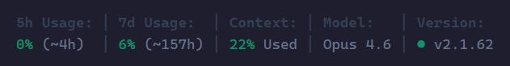
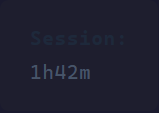
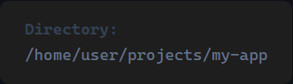

# METRICC
### A Clean, Lightweight, Design-Focused Status Bar for Claude Code
---


##  Choose Inline or Stacked

Two layout modes. Same data. Pick whichever fits your workflow.

**Vertical** — labels on top, values below (default)



**Horizontal** — labels and values on one line, half the height


Set `"layout": "horizontal"` or `"layout": "vertical"` in your config file.

---

##  Choose From 16 Stats

###### Rate Limits
 -  5-hour usage %
 -  7-day usage %
 -  5-hour reset countdown
 -  7-day reset countdown

###### Context & Tokens
 -  Context window used
 -  Input tokens
 -  Output tokens
 -  Cache hit rate

###### Session Info
 -  Session duration
 -  API response time
 -  Lines added / removed
 -  Working directory
 -  Session cost (USD)

###### Model & Version
 -  Current model
 -  Claude Code version

###### Auto (appear when active)
 -  Running agents + tree view
 -  Todo progress

---

##  Simple Config File

 -  Toggle any stat on or off
 -  Switch between horizontal and vertical layouts
 -  No restart required — changes apply on next render

```jsonc
{
  "layout": "vertical",     // or "horizontal"
  "5h Usage": true,
  "Context": true,
  "Cost": true,
  "Session": false
  // ... see full config below
}
```

---

##  Modern Color Palette

 -  Removed boring ANSI color palette
 -  Replaced with Tailwind CSS colors

| Color | Hex | Used For |
|-------|-----|----------|
|  Emerald-600 | `#059669` | Healthy / normal values |
|  Amber-600 | `#d97706` | Warning thresholds |
|  Red-600 | `#dc2626` | Critical thresholds |
|  Slate-700 | `#334155` | Labels and separators |
|  Slate-600 | `#64748b` | Data values |

---

##  No Dependencies

 -  Nothing to install
 -  No npm packages
 -  No tracking or telemetry
 -  Pure Node.js — uses your existing Claude Code session

---

##  Agents Row

 -  Only appears when agent(s) are active
 -  Shows which model each agent is using
 -  Shows what task each agent is performing
 -  Models are color-coded: **Opus** (purple), **Sonnet** (cyan), **Haiku** (green)


---

##  Color-Coded Thresholds

Values change color as they approach limits. Rate limits, context window, and cost all follow the same pattern:

| | Rate Limits | Context Window | Cost |
|---|---|---|---|
| **Green** | 0–59% | 0–69% | < $0.25 |
| **Amber** | 60–79% | 70–84% | $0.25–$1.00 |
| **Red** | 80%+ | 85%+ | $1.00+ |

&nbsp;&nbsp;&nbsp;&nbsp;&nbsp;&nbsp;

---

##  Segment Details

###### Rate Limits — `5h Usage` and `7d Usage`

Anthropic API usage across two rolling windows. The percentage shows usage, the time in parentheses is a countdown until reset. Shows `(~3h)` for rough estimates and switches to exact minutes under 60m.


###### Context Window — `Context`

How full the current conversation's context window is.


###### Code Changes — `Changes`

Lines added (green) and removed (red) this session.


###### Model and Version — `Model` `Version`

Current Claude model and Claude Code version. Green dot = latest. Yellow dot = update available.


###### Session Timer — `Session`

How long the current session has been running. Shows `1h42m` or `4m22s` for shorter sessions.



###### Cost — `Cost`

Session cost in USD, color-coded by spend.

&nbsp;&nbsp;&nbsp;&nbsp;&nbsp;&nbsp;

###### Working Directory — `Directory`

Current workspace path.



###### Agents and Todos

Agents and todos appear on a third row only when active. The agent tree shows type, model, elapsed time, and task description. Agents older than 30 minutes are automatically hidden.


---

## Features at a Glance

| Segment | Section | Default | Description |
|---------|---------|---------|-------------|
| 5h Usage | Standard | On | 5-hour rolling rate limit with reset countdown |
| 7d Usage | Standard | On | 7-day rolling rate limit with reset countdown |
| Context | Standard | On | Context window usage percentage |
| Model | Standard | On | Current Claude model (Opus 4.6, Sonnet 4.5, etc.) |
| Version | Standard | On | Claude Code version with update indicator dot |
| Session | Session | Off | How long the current session has been running |
| Changes | Session | Off | Lines added/removed this session |
| Directory | Session | Off | Current workspace path |
| Cost | Session | Off | Session cost in USD |
| Tokens | Advanced | Off | Total input tokens in current context |
| Output Tokens | Advanced | Off | Cumulative output tokens across session |
| Cache | Advanced | Off | Cache read hit rate percentage |
| API Time | Advanced | Off | Time spent waiting for API responses |
| 5h Reset | Advanced | Off | Standalone 5-hour reset countdown |
| 7d Reset | Advanced | Off | Standalone 7-day reset countdown |
| Agents | Auto | Auto | Running agent count + tree (appears when active) |
| Todos | Auto | Auto | Task progress (appears when active) |

---

##  Configuration

METRICC is configurable via `~/.claude/hud/config.jsonc`. The file uses JSONC (JSON with comments).

```jsonc
{
  // ── Layout ──────────────────────────────────────────
  // "vertical"   = labels above values (two rows, default)
  // "horizontal" = labels next to values (single compact row)
  "layout": "vertical",

  // ── Standard (on by default) ──
  "5h Usage": true,
  "7d Usage": true,
  "Context": true,
  "Model": true,
  "Version": true,

  // ── Session (off by default) ──
  "Session": false,
  "Changes": false,
  "Directory": false,
  "Cost": false,

  // ── Advanced (off by default) ──
  "Tokens": false,
  "Output Tokens": false,
  "Cache": false,
  "API Time": false,
  "5h Reset": false,
  "7d Reset": false
}
```

 - Set a column to `true` to show it, `false` to hide it
 - Missing keys fall back to their section default (Standard = on, Session/Advanced = off)
 - If the file doesn't exist, you get the 5 Standard columns
 - The file is read every render — no restart needed

> **Tip:** Ask Claude Code to edit this for you: *"Turn on Cost and Session in my HUD config"*

---

##  Responsive Width

On narrow terminals, METRICC automatically drops columns to fit. It removes the least important segments first:

1. Advanced columns drop first (7d Reset, 5h Reset, API Time, etc.)
2. Then Session columns (Directory, Cost, Session, Changes)
3. Then Version
4. Standard columns (5h/7d Usage, Context, Model) are kept as long as possible

This happens automatically — no configuration needed.

---

##  Setup

Two steps: **save the file**, then **point Claude Code to it**.

### Step 1 — Save the script

<details>
<summary><strong>macOS / Linux</strong></summary>

```bash
mkdir -p ~/.claude/hud
curl -o ~/.claude/hud/metricc-cc-statusbar.mjs https://raw.githubusercontent.com/professionalcrastinationco/METRICC/main/metricc-cc-statusbar.mjs
```

Your file is now at: `~/.claude/hud/metricc-cc-statusbar.mjs`

</details>

<details>
<summary><strong>Windows (PowerShell)</strong></summary>

```powershell
New-Item -ItemType Directory -Force -Path "$env:USERPROFILE\.claude\hud"
Invoke-WebRequest -Uri "https://raw.githubusercontent.com/professionalcrastinationco/METRICC/main/metricc-cc-statusbar.mjs" -OutFile "$env:USERPROFILE\.claude\hud\metricc-cc-statusbar.mjs"
```

Your file is now at: `C:\Users\<your-username>\.claude\hud\metricc-cc-statusbar.mjs`

</details>

<details>
<summary><strong>Manual download (any OS)</strong></summary>

1. Click on `metricc-cc-statusbar.mjs` in this repo
2. Click the **Raw** button (or **Download**)
3. Save to `~/.claude/hud/metricc-cc-statusbar.mjs`
4. Create the `hud` folder first if it doesn't exist

</details>

### Step 2 — Tell Claude Code to use it

Add this to `~/.claude/settings.json`:

```json
{
  "statusLine": {
    "type": "command",
    "command": "node ~/.claude/hud/metricc-cc-statusbar.mjs",
    "padding": 0
  }
}
```

> **Windows users:** Use your full path:
> ```json
> "command": "node C:\\Users\\YourName\\.claude\\hud\\metricc-cc-statusbar.mjs"
> ```

If your settings file already has content, merge the `statusLine` object in — don't replace what's already there.

<details>
<summary>Example: merging with existing settings</summary>

```json
{
  "env": {
    "SOME_OTHER_SETTING": "value"
  },
  "permissions": {
    "allow": ["Bash(npm test)"]
  },
  "statusLine": {
    "type": "command",
    "command": "node ~/.claude/hud/metricc-cc-statusbar.mjs",
    "padding": 0
  }
}
```

</details>

<details>
<summary>Alternative: env var method</summary>

```json
{
  "env": {
    "CLAUDE_CODE_STATUSLINE_COMMAND": "node ~/.claude/hud/metricc-cc-statusbar.mjs"
  }
}
```

> This works on most platforms but **may not work on WSL2 or some Linux setups**. If it doesn't work, use the `statusLine` config object above instead.

</details>

### Step 3 — Restart Claude Code

Close and reopen Claude Code. The HUD appears at the bottom of your terminal.

> **Tip:** You can also ask Claude Code to do Step 2 for you:
> *"Set my statusline command to `node ~/.claude/hud/metricc-cc-statusbar.mjs`"*

### Upgrading

Re-run the download command from Step 1 to overwrite the old file. Your settings don't need to change.

If you were using the separate v2 script (`metricc-cc-statusbar-v2.mjs`), switch your settings to point to `metricc-cc-statusbar.mjs` instead — macOS Keychain support is now built in.

---

## Requirements

 - **Node.js 18+** — you already have this if Claude Code is installed
 - **Claude Code** with an active login

---

<details>
<summary><strong>Technical Details</strong></summary>

### How It Works

Claude Code sends JSON data to the statusline command every time the display refreshes. The HUD:

1. Calculates context window usage from token counts
2. Fetches rate limits from the Anthropic API (cached 60s)
3. Reads the session transcript for running agents and todo progress
4. Checks npm for the latest Claude Code version (cached 1hr)
5. Renders everything as a color-coded, column-aligned status line

All network requests run simultaneously so the HUD stays fast.

### Caching

| Data | Refreshes Every | Stored At |
|------|-----------------|-----------|
| Rate limits | 60 seconds | `~/.claude/hud/.usage-cache.json` |
| CC version | 1 hour | `~/.claude/hud/.version-cache.json` |

### Credential Handling

The script reads credentials in this order:

1. `~/.claude/.credentials.json` (all platforms)
2. macOS Keychain via `security find-generic-password` (macOS only, automatic fallback)

Tokens are refreshed automatically when expired.

</details>

---

##  Why This Exists

There are already a hundred Claude Code status bars. Most of them look like someone threw a JSON object at a terminal and called it a day.

I'm a graphic designer with 20+ years of experience and ADHD. I notice when something looks like shit, and I physically cannot parse cluttered information without my brain leaving the building. So I built the status bar I actually wanted to look at.

1. **Scannability** — Glance for half a second, get what you need. If you have to *read* a status bar, it failed.
2. **Zero visual noise** — No borders, no boxes, no unnecessary separators. Just the data, breathing.
3. **Zero dependencies** — Pure Claude Code API. Nothing to install, nothing to break.

If you want charts and twelve customizable widgets, there are great options out there. If you just want to glance down and know what's going on, this is it.

---

## Who Built This

Claude Code wrote the code. I just refused to accept "good enough" approximately forty-seven times in a row. Claude Code's contribution was not telling me to go fuck myself, which honestly showed remarkable restraint.

---

##  Acknowledgments

METRICC was inspired by the [oh-my-claudecode](https://github.com/Yeachan-Heo/oh-my-claudecode) framework. OMC is a multi-agent orchestration system for Claude Code — go check it out.

## License

MIT
