# METRICC
### A Clean, Lightweight, Design-Focused Status Bar for Claude Code
---

##  Choose Inline or Stacked
Two layout modes. Same data. Pick whichever fits your workflow.

**Stacked** — labels on top, values below (default)

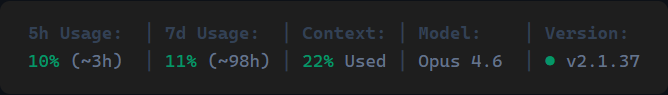

**Horizontal** — labels and values on one line, half the height

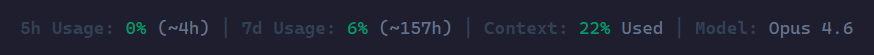

---
##  Why This Exists

I'm a graphic designer with 20+ years of experience and a partner named ADHD. 

This is the only Claude Code status bar (that I am aware of) that was created from a "design first" perspective.

With a focus on color, spacing, and a great user experience, I spent more time than I would like to admit fine tuning everything. 

 - **Is it perfect? NO!**
    - ###### ADHD rarely let's me be satisfied or think something I have done is perfect. 

 - **Will it get better?**
    - ###### Eh. Maybe? We'll see if I get bored of it or not. 

In the meantime, I hope you enjoy...

---

##  Requirements

 -  Node.js 18+ (you already have this if Claude Code is installed)
 -  Claude Code with an active login
 -  No npm packages
 -  No tracking or telemetry

---

##  Color-Coded Thresholds

Values change color as they approach limits:

| | Rate Limits | Context Window | Cost |
|---|---|---|---|
| **Green** | 0–59% | 0–69% | < $0.25 |
| **Amber** | 60–79% | 70–84% | $0.25–$1.00 |
| **Red** | 80%+ | 85%+ | $1.00+ |

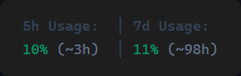&nbsp;&nbsp;&nbsp;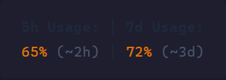&nbsp;&nbsp;&nbsp;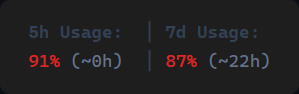

---

##  Segments Up Close

**Rate Limits** — 5h and 7d rolling windows with reset countdowns

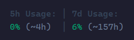

**Context** — how full the current conversation window is

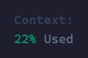

**Changes** — lines added (green) and removed (red) this session

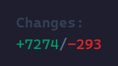

**Model & Version** — green dot = latest, yellow dot = update available

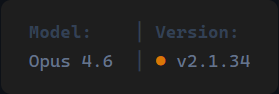

**Cost** — color-coded by spend

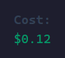&nbsp;&nbsp;&nbsp;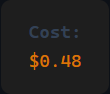&nbsp;&nbsp;&nbsp;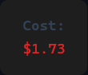

**Agents** — auto-appears when active, shows model + task per agent

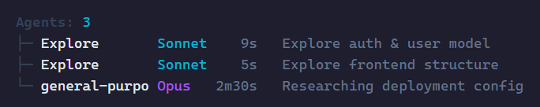

---

##  Choose From 16 Stats

###### Rate Limits
 -  5-hour usage %
 -  7-day usage %
 -  5-hour reset countdown
 -  7-day reset countdown

###### Context & Tokens
 -  Context window used
 -  Input tokens
 -  Output tokens
 -  Cache hit rate

###### Session Info
 -  Session duration
 -  API response time
 -  Lines added / removed
 -  Working directory
 -  Session cost (USD)

###### Model & Version
 -  Current model
 -  Claude Code version

###### Auto (appear when active)
 -  Running agents + tree view
 -  Todo progress

---

##  Install

Pick whichever method you're most comfortable with. All three get you the same result.

<details>
<summary><strong> Easy — Let Claude Do It</strong></summary>

&nbsp;

Copy the repo URL below and paste it into Claude Code with the prompt:

```
https://github.com/professionalcrastinationco/METRICC

Install the METRICC statusline from this repo.
```

Claude will download the script, update your settings, and restart — no manual steps needed.

</details>

<details>
<summary><strong> Manual — Download & Configure</strong></summary>

&nbsp;

#### Step 1 — Download the script

Go to the [raw script file](https://raw.githubusercontent.com/professionalcrastinationco/METRICC/main/metricc-cc-statusbar.mjs) and save it to your Claude config folder:

| OS | Save to |
|---|---|
| **macOS / Linux** | `~/.claude/hud/metricc-cc-statusbar.mjs` |
| **Windows** | `C:\Users\YourName\.claude\hud\metricc-cc-statusbar.mjs` |

Create the `hud` folder if it doesn't exist.

#### Step 2 — Update settings

Open your `settings.json` file:

| OS | Location |
|---|---|
| **macOS / Linux** | `~/.claude/settings.json` |
| **Windows** | `C:\Users\YourName\.claude\settings.json` |

Add the following block (or merge it into your existing settings):

**macOS / Linux:**
```json
{
  "statusLine": {
    "type": "command",
    "command": "node ~/.claude/hud/metricc-cc-statusbar.mjs",
    "padding": 0
  }
}
```

**Windows:**
```json
{
  "statusLine": {
    "type": "command",
    "command": "node C:\\Users\\YourName\\.claude\\hud\\metricc-cc-statusbar.mjs",
    "padding": 0
  }
}
```

#### Step 3 — Restart Claude Code

</details>

<details>
<summary><strong> Advanced — Terminal Commands</strong></summary>

&nbsp;

#### macOS / Linux (Bash)

```bash
mkdir -p ~/.claude/hud
curl -o ~/.claude/hud/metricc-cc-statusbar.mjs \
  https://raw.githubusercontent.com/professionalcrastinationco/METRICC/main/metricc-cc-statusbar.mjs
```

Then add to `~/.claude/settings.json`:
```json
{
  "statusLine": {
    "type": "command",
    "command": "node ~/.claude/hud/metricc-cc-statusbar.mjs",
    "padding": 0
  }
}
```

#### Windows (PowerShell)

```powershell
New-Item -ItemType Directory -Force -Path "$env:USERPROFILE\.claude\hud"
Invoke-WebRequest -Uri "https://raw.githubusercontent.com/professionalcrastinationco/METRICC/main/metricc-cc-statusbar.mjs" `
  -OutFile "$env:USERPROFILE\.claude\hud\metricc-cc-statusbar.mjs"
```

Then add to `C:\Users\YourName\.claude\settings.json`:
```json
{
  "statusLine": {
    "type": "command",
    "command": "node C:\\Users\\YourName\\.claude\\hud\\metricc-cc-statusbar.mjs",
    "padding": 0
  }
}
```

#### After either — Restart Claude Code

</details>

> **Want the bar to redraw on a timer?** By default it only redraws when something happens (e.g. you send a message), so an idle session shows frozen numbers in between. Add `"refreshInterval": 10` inside the `statusLine` block above to redraw every 10s instead. It costs a fresh Node process + transcript parse each interval, so it's opt-in rather than part of the default setup.

> **Upgrading?** Re-run the download or let Claude re-install. Your config is preserved.

---

##  Configuration

Edit `~/.claude/hud/config.jsonc` to toggle any stat on or off:

```jsonc
{
  "layout": "vertical",     // or "horizontal"

  // ── Standard (on by default) ──
  "5h Usage": true,
  "7d Usage": true,
  "Context": true,
  "Model": true,
  "Version": true,

  // ── Session (off by default) ──
  "Session": false,
  "Changes": false,
  "Directory": false,
  "Cost": false,

  // ── Advanced (off by default) ──
  "Tokens": false,
  "Output Tokens": false,
  "Cache": false,
  "API Time": false,
  "5h Reset": false,
  "7d Reset": false
}
```

 -  No restart required — changes apply on next render
 -  Missing keys fall back to their section default

---

##  FAQ

**All I see is the labels, no values** — [#4](https://github.com/professionalcrastinationco/METRICC/issues/4)

You probably have more stats set to display than the width of your terminal window can support. We're working on making this more responsive. For now, the fix is to set some of the stats you can go without viewing to `false` in your `config.jsonc` file.

---

##  Known Bugs

 - **The first label color gets darker randomly** — [#3](https://github.com/professionalcrastinationco/METRICC/issues/3)

---

##  Acknowledgments

METRICC was inspired by the [oh-my-claudecode](https://github.com/Yeachan-Heo/oh-my-claudecode) framework.

Thanks to the following contributors who submitted PRs that helped shape improvements already included in METRICC:

 - [@crimist](https://github.com/crimist) — API cost support ([#2](https://github.com/professionalcrastinationco/METRICC/pull/2))
 - [@DustyDiamond](https://github.com/DustyDiamond) — statusLine config fix ([#1](https://github.com/professionalcrastinationco/METRICC/pull/1))

## License

MIT
